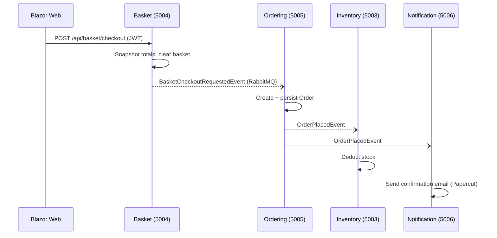

# RabitMQ_ShoppingCart
RabitMQ ShoppingCart POC

# Shopping Cart Microservices POC

Event-driven shopping cart built with **.NET 10 Minimal APIs**, **Clean Architecture + DDD**,
**database-per-service (SQL Server + EF Core)**, and **RabbitMQ (via MassTransit)** as the
message broker. The **Blazor front end lives in its own solution** and talks to the services
over HTTP with JWT bearer tokens.

## Solutions

| Solution | Path | Contents |
|---|---|---|
| `ShoppingCart.Backend.sln` | `backend/` | 6 microservices + building blocks |
| `ShoppingCart.Web.sln` | `frontend/` | Blazor Web App (Interactive Server) |

## Services

| Service | Port | Database | Owns | Publishes | Consumes |
|---|---|---|---|---|---|
| Identity | 5001 | IdentityDb | Users, JWT issuance | — | — |
| Catalog | 5002 | CatalogDb | Product & category data | `ProductCreatedEvent` | — |
| Inventory (Stock & Price) | 5003 | InventoryDb | Stock levels, prices | `ProductPriceChangedEvent` | `ProductCreatedEvent`, `OrderPlacedEvent` |
| Basket | 5004 | BasketDb | Shopping cart + basket calculation (discount, VAT, totals) | `BasketCheckoutRequestedEvent` | `ProductPriceChangedEvent` |
| Ordering (Checkout) | 5005 | OrderingDb | Orders | `OrderPlacedEvent` | `BasketCheckoutRequestedEvent` |
| Notification | 5006 | NotificationDb | Email log | — | `OrderPlacedEvent` |
| Blazor Web | 5100 | — | UI | — | — |

Every service follows the same Clean Architecture layout:
`*.Domain` (entities + business rules) → `*.Application` (use cases, DTOs, repository interfaces)
→ `*.Infrastructure` (EF Core DbContext, repositories, external adapters) → `*.Api`
(Minimal API endpoints + MassTransit consumers as the composition root).

## Event flow



Other event choreography:
- Catalog `POST /api/products` → `ProductCreatedEvent` → Inventory creates an empty stock record.
- Inventory `PUT /api/stock/{id}` with a new price → `ProductPriceChangedEvent` → Basket re-prices open baskets.

## Prerequisites

- .NET 10 SDK
- Docker Desktop

## Running

**1. Infrastructure** (RabbitMQ, SQL Server, Papercut SMTP) — from the repo root:

```bash
docker compose up -d
```

**2. Backend** — from `backend/`:

```powershell
.\run-all-services.ps1          # or: dotnet run --project src/Services/<X>/<X>.Api per service
```

Each service creates and seeds its own database on first start (`EnsureCreated`, with retries
while SQL Server boots).

**3. Frontend** — from `frontend/`:

```bash
dotnet run --project src/ShoppingCart.Web
```

Open **http://localhost:5100**.

## Demo walkthrough

1. Log in as the seeded user `demo@shop.local` / `Pass@123` (or register a new user).
2. Browse **Products** — descriptions come from Catalog; price/stock come from Inventory.
3. Add items to the **Basket** — subtotal, 10% discount over 100, 5% VAT, and total are computed
   in the `ShoppingBasket` aggregate (domain layer), not the UI.
4. **Checkout** — Basket publishes to RabbitMQ and returns immediately (202 Accepted).
5. **My Orders** — refresh after a second; Ordering has consumed the event and created the order.
6. Confirmation email — open Papercut at **http://localhost:8080**.
7. Stock deducted — check `GET http://localhost:5003/api/stock`.
8. Price propagation — `PUT http://localhost:5003/api/stock/{productId}` with a new price while
   the item is in a basket, then reload the basket page.

## Useful URLs

| What | URL |
|---|---|
| RabbitMQ management | http://localhost:15672 (guest/guest) |
| Papercut inbox | http://localhost:8080 |
| API docs (Scalar) | http://localhost:500X/scalar/v1 on every service |

## POC shortcuts (and what to do in production)

- **`EnsureCreated` + seed** → use EF Core migrations per service.
- **Direct publish after `SaveChanges`** in the checkout consumer → use MassTransit's
  **Transactional Outbox** (`AddEntityFrameworkOutbox`) so the DB write and publish are atomic.
- **Symmetric JWT key shared across services** → asymmetric keys (RS256) with the public key
  distributed, or a proper identity provider.
- **One SQL Server instance hosting six databases** → each service gets its own server/instance
  (the schema isolation is already enforced here: no service touches another's database).
- **In-memory token on the Blazor circuit** (refresh logs you out) → auth cookie or
  `ProtectedLocalStorage`.
- **Frontend calls services directly** → add an API gateway (YARP/Ocelot) as a single entry point.
- **Consumers are idempotent-ish** (e.g., `ProductCreatedConsumer` checks existence) → add
  proper inbox/deduplication for at-least-once delivery.

